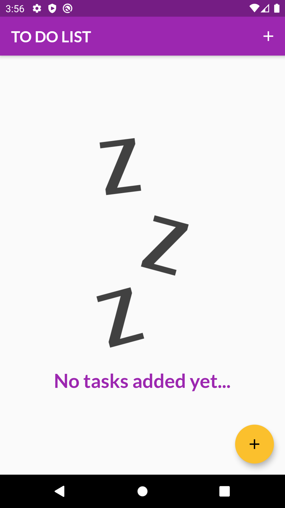
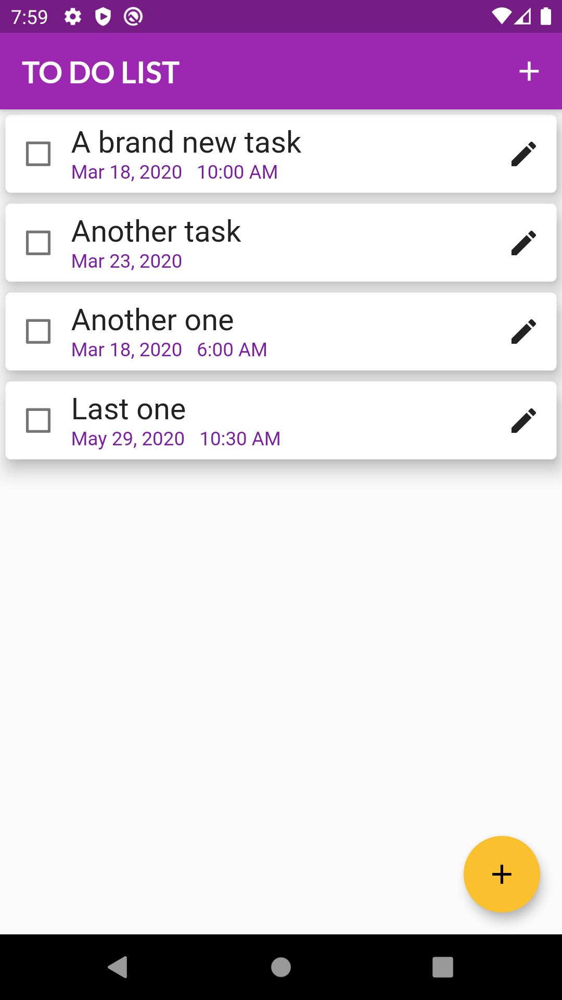
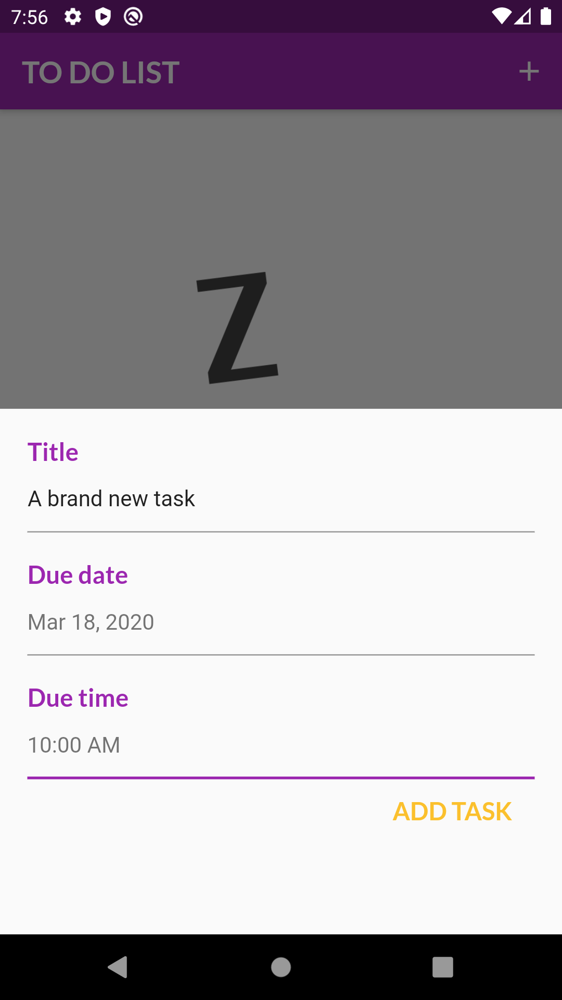
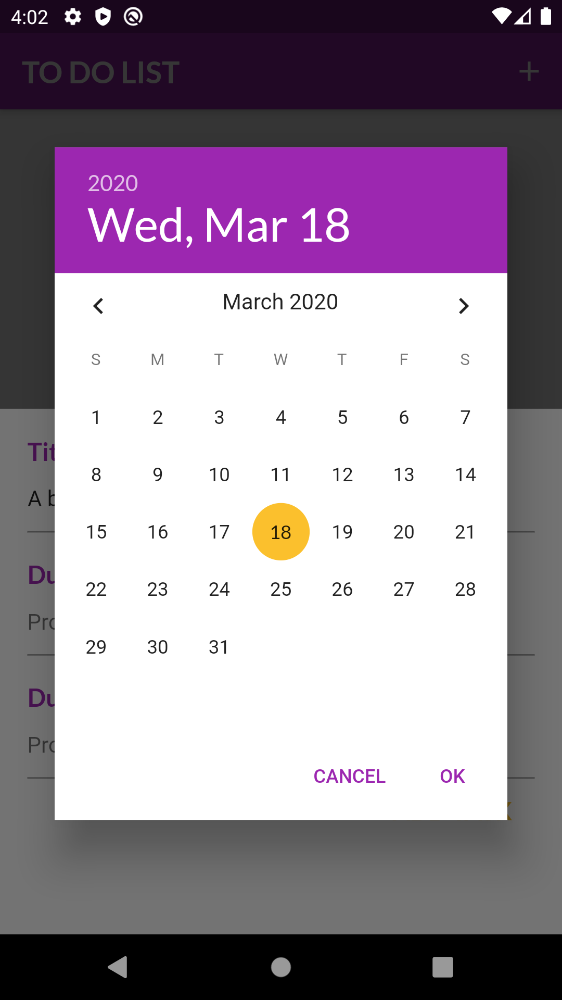
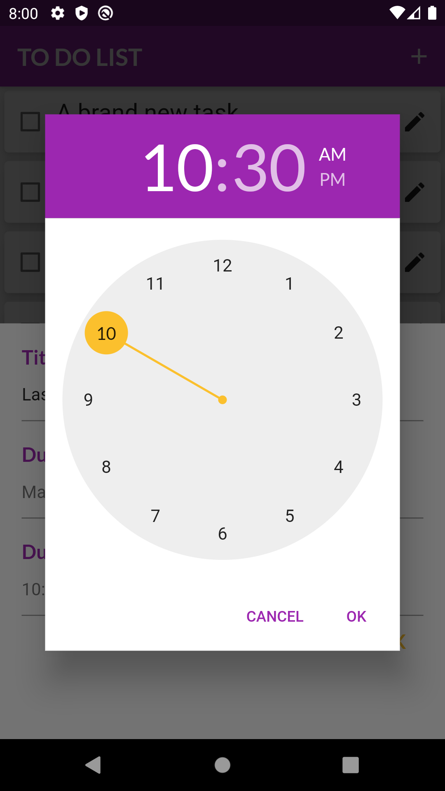

# To-Do List

 <h1>Introduction</h1>
 
  I've always used to-do lists, and since I didn't knew what to do as my first independent Dart/Flutter project, I've chosen to create my
own to-do list app, so, here it is. It's very simple, but it helped me to understand and put into practice a lot of things, that before this project, I've had only learned thorugh theory or coding along with courses.
 
  <h1>Features</h1>
 
  - Users can create their own tasks by clicking on the '+' buttons.
  - You can mark a task as done by cliking on it (check it).
  - When creating a task you may choose to add a deadline, including only a date or a date and a time.
  - You can edit tasks by clicking on the pen button.
  - You can delete a task by sliding it from right to left.
 
  <h1>Possible features</h1>
  
  - Use SQLite to store tasks.
  - User could add more than one list.
  - User could receive a push-up when a task is expired.
  - Users could change the color scheme of the app.
  
   <h1>Screenshots</h1>
 
 <b>Homepage</b>
  
  
  
  
  
 <b>Add New Task</b>
  
 
  
  
 <b>Pick Date and Time</b>
  
  
  
